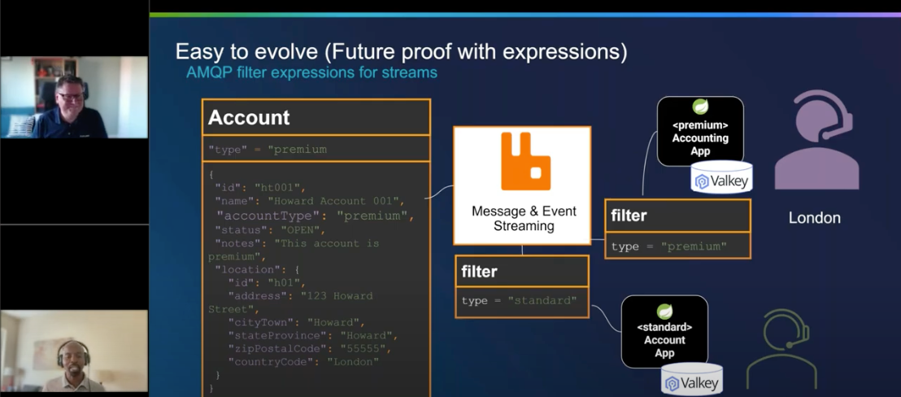

# Spring Design Data Patterns

This project demonstrates data design patterns using the [Spring](http://spring.io) framework.

## Projects

| Project                                                                  | Category    | Notes                                                     |
|--------------------------------------------------------------------------|-------------|-----------------------------------------------------------|
| [Data integration filter](applications/patterns/integration/filtering)   | Integration | Showcase for RabbitMQ AMQP filter expressions for streams |
| [reliable-delivery](applications/patterns/integration/reliable-delivery) | Integration | Reliable delivery APIs using RabbitMQ                     |

## Publications

[RabbitMQ 4.1 Features - ex: AMQP 1.0 Filtering](https://www.youtube.com/watch?v=Hqcfhu9_lJc)

