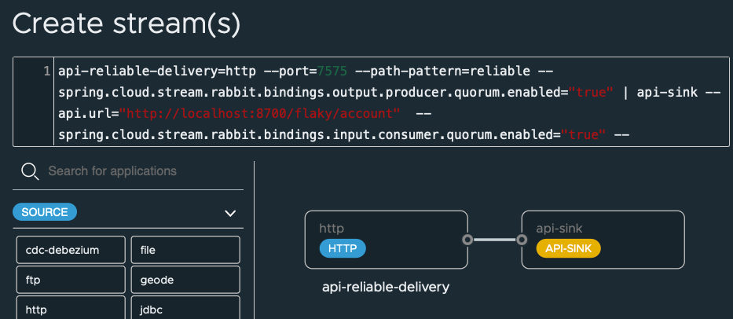

# Reliable Delivery

Showcase reliable delivery with RabbitMQ, ValKey and Spring.

Prerequisite

- Podman
- Java 17
- Maven


## Getting Started


### Start RabbitMQ

```shell
./deployment/local/rabbitmq/start.sh
```
### Start ValKey

Start ValKey
```shell
./deployment/local/valkey/start.sh
```

Start CLI

```shell
./deployment/local/valkey/start-cli.sh
```

Start Flaky API on 8700
```shell
java -jar applications/patterns/integration/reliable-delivery/apps/flaky-api-app/target/flaky-api-app-0.1.1-SNAPSHOT.jar
```


Start Registration App


```shell
java -jar applications/patterns/integration/reliable-delivery/apps/registration-app/target/registration-app-0.0.1-SNAPSHOT.jar --registration.reliable.uri="http://localhost:7575/reliable" --registration.flaky.uri="http://localhost:8700/flaky/account"
```

```shell
open http://localhost:8097
```


Start Cache App

```shell
java -jar applications/patterns/caching/apps/account-cache-app/target/account-cache-app-0.1.1-SNAPSHOT.jar
```

```shell
open http://localhost:8001
```


## Start Sink

------------
# Start SCDF

## Request API  SInk


Install and start [Spring Cloud DataFlow locally](https://dataflow.spring.io/docs/installation/local/)


Open dashboard

```shell
open http://localhost:9393/dashboard
```


Register Sink with the following

Client Applications -> Register -> By Properties

See api-throttle properties

```properties
sink.api-sink=file:///Users/Projects/solutions/Spring/dev/spring-design-data-patterns/applications/patterns/integration/reliable-delivery/sinks/api-sink/target/api-sink-0.0.1-SNAPSHOT.jar
sink.api-sink.bootVersion=3
```

Create Stream



```shell
api-reliable-delivery=http --port=7575 --path-pattern=reliable --spring.cloud.stream.rabbit.bindings.output.producer.quorum.enabled="true" | api-sink --api.url="http://localhost:8700/flaky/account"  --spring.cloud.stream.rabbit.bindings.input.consumer.quorum.enabled="true" --spring.cloud.stream.bindings.input.consumer.maxAttempts=10000
```


Additional Optional Configurations

```properties
app.api-sink.spring.cloud.stream.bindings.input.consumer.backOffInitialInterval=1000
app.api-sink.spring.cloud.stream.bindings.input.consumer.backOffMaxInterval=1000
app.api-sink.spring.cloud.stream.bindings.input.consumer.backOffMultiplier=1
```

