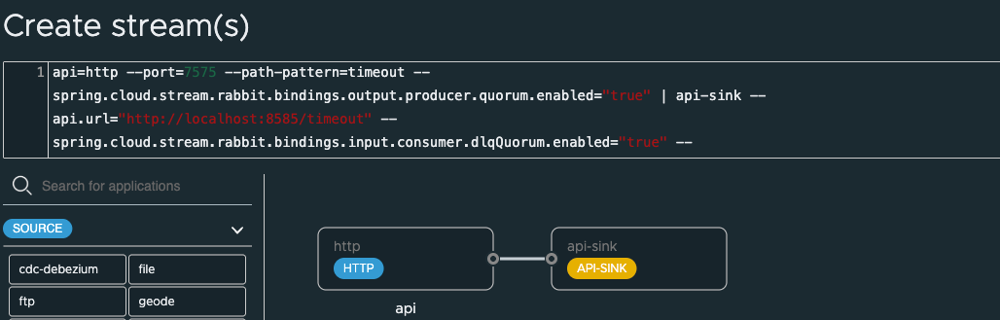

# API Throttling Sink

Showcase for API Sink with RabbitMQ and Spring.

------------
# Start App


```shell
java -jar applications/patterns/integration/reliable-delivery/sinks/api-sink/target/api-sink-0.0.1-SNAPSHOT.jar --api.url="http://localhost:8700/flaky/account"
```
------------
# Start SCDF

## Request API  SInk


Install and start [Spring Cloud DataFlow locally](https://dataflow.spring.io/docs/installation/local/)


Open dashboard

```shell
open http://localhost:9393/dashboard
```


Register Sink with the following

Client Applications -> Register -> By Properties

See api-throttle properties

```properties
sink.api-sink=file:///Users/Projects/solutions/Spring/dev/spring-design-data-patterns/applications/patterns/integration/reliable-delivery/sinks/api-sink/target/api-sink-0.0.1-SNAPSHOT.jar
sink.api-sink.bootVersion=3
```

Create Stream


```shell
api-reliable-delivery=http --port=7575 --path-pattern=reliable --spring.cloud.stream.rabbit.bindings.output.producer.quorum.enabled="true" | api-sink --api.url="http://localhost:8700/flaky/account" --spring.cloud.stream.rabbit.bindings.input.consumer.dlqQuorum.enabled="true" --spring.cloud.stream.rabbit.bindings.input.consumer.autoBindDlq="true" --spring.cloud.stream.rabbit.bindings.input.consumer.republishToDlq="true" --spring.cloud.stream.rabbit.bindings.input.consumer.deadLetterExchange=apiDlx --spring.cloud.stream.rabbit.bindings.input.consumer.quorum.enabled="true"
```


```shell
api-reliable-delivery=http --port=7575 --path-pattern=reliable --spring.cloud.stream.rabbit.bindings.output.producer.quorum.enabled="true" | api-sink --api.url="http://localhost:8700/flaky/account"  --spring.cloud.stream.rabbit.bindings.input.consumer.quorum.enabled="true"
```

Example Deployment Properties

```properties
app.api-sink.api.url="http://localhost:8585/timeout"
app.api-sink.spring.cloud.stream.rabbit.bindings.input.consumer.autoBindDlq=true
app.api-sink.spring.cloud.stream.rabbit.bindings.input.consumer.deadLetterExchange=apiThrottleDlx
app.api-sink.spring.cloud.stream.rabbit.bindings.input.consumer.dlqQuorum.enabled=true
app.api-sink.spring.cloud.stream.rabbit.bindings.input.consumer.quorum.enabled=true
app.api-sink.spring.cloud.stream.rabbit.bindings.input.consumer.republishToDlq=true
app.http.path-pattern=reliable
app.http.server.port=7575
app.http.spring.cloud.stream.rabbit.bindings.output.producer.quorum.enabled=true
```


Additional Optional Configurations

```properties
app.api-sink.spring.cloud.stream.bindings.input.consumer.backOffInitialInterval=1000
app.api-sink.spring.cloud.stream.bindings.input.consumer.backOffMaxInterval=1000
app.api-sink.spring.cloud.stream.bindings.input.consumer.backOffMultiplier=1
app.api-sink.spring.cloud.stream.bindings.input.consumer.maxAttempts=3
```

------------------------------
# Standalone (Without SCDF) Testing

Sett http-source

```shell
java -jar /Users/devtools/integration/scdf/apps/http/http-source-rabbit-4.0.0.jar  --spring.cloud.stream.bindings.output.destination=api-throttle --http.path-pattern=timeout  --server.port=7575 --spring.rabbitmq.username=user --spring.rabbitmq.password=bitnami
```

Randomly Failures

```shell
curl -X 'POST' \
  'http://localhost:7575/reliable' \
  -H 'accept: */*' \
  -H 'Content-Type: application/json' \
  -d '{
  "id": "string",
  "name": "string",
  "accountType": "string",
  "status": "string",
  "notes": "string",
  "location": {
    "id": "string",
    "address": "string",
    "cityTown": "string",
    "stateProvince": "string",
    "zipPostalCode": "string",
    "countryCode": "string"
  }
}'
```

Test Timeout to DQL

```shell
curl -X 'POST' \
  'http://localhost:7575/timeout' \
  -H 'accept: */*' \
  -H 'Content-Type: application/json' \
  -d '{
  "id": "string",
  "name": "string",
  "accountType": "string",
  "status": "TIMEOUT",
  "notes": "string",
  "location": {
    "id": "string",
    "address": "string",
    "cityTown": "string",
    "stateProvince": "string",
    "zipPostalCode": "string",
    "countryCode": "string"
  }
}'
```


---------------------------------------
# Docker building image

```shell
mvn install
cd applications/api-throttling-sink
mvn package
docker build  --platform linux/amd64,linux/arm64 -t api-throttling-sink:0.0.1-SNAPSHOT .

```

```shell
docker tag api-throttling-sink:0.0.1-SNAPSHOT cloudnativedata/api-throttling-sink:0.0.1-SNAPSHOT
docker push cloudnativedata/api-throttling-sink:0.0.1-SNAPSHOT
```
